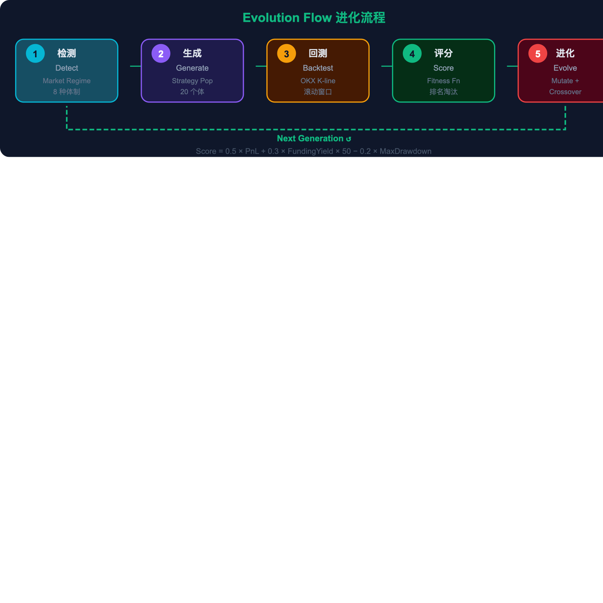

# GeneFi - 基因金融 | Gene + DeFi Evolution Engine

<div align="center">

**用遗传进化算法驱动 DeFi 交易策略自适应优化的多智能体系统**

*A multi-agent system powered by genetic evolution for adaptive DeFi trading strategy optimization*

[](https://www.okx.com/zh-hans/agent-tradekit)
[](https://github.com/okx/agent-trade-kit)
[](https://web3.okx.com/zh-hans/onchainos)
[](https://github.com/okx/onchainos-skills)
[](https://brian5216.github.io/GeneFi/)

**[Live Demo](https://brian5216.github.io/GeneFi/) · [GitHub Repo](https://github.com/Brian5216/GeneFi) · [OKX Agent Trade Kit](https://www.okx.com/zh-hans/agent-tradekit)**

</div>

---

<div align="center">

<br><br>

</div>

---

## What is GeneFi? 什么是 GeneFi？

为什么大多数交易策略用了一阵就不行了？因为市场在变。牛市的参数到熊市就是送钱，趋势跟踪在震荡期会被反复打脸。

GeneFi 的解决方案来自达尔文：**让策略自己进化**。每套交易策略是一个"生物个体"，通过遗传变异、交叉互换和自然选择，策略种群在真实市场中自动进化——不需要手动调参数，不需要盯盘，它自己来。

| 生物学 Biology | GeneFi 对应 Mapping |
|---|---|
| 基因 DNA | 策略参数 Strategy Parameters (leverage, direction, hedge ratio...) |
| 个体 Individual | 一套完整的交易策略 A complete trading strategy |
| 种群 Population | 当前所有策略集合 All 20 strategies in the population |
| 适应度 Fitness | 综合盈利能力评分 Combined profitability score |
| 自然选择 Selection | 淘汰表现差的策略 Eliminate bottom 30% |
| 变异 Mutation | 参数微调产生后代 Parameter tweaks for offspring |
| 交叉 Crossover | 两个精英策略基因组合 Gene combination from two elite parents |

---

## Three-Agent Architecture 三智能体闭环

GeneFi 由三个自治 AI Agent 组成闭环，通过 A2A（Agent-to-Agent）协议协作，无需人工干预：

| Agent | Model | 职责 Role |
|---|---|---|
| **预测者 Predictor** | Claude Opus | 检测 8 种市场体制（牛市波动、熊市波动、趋势上行/下行、高波动、资金费率极端正/负、震荡盘整），生成市场自适应策略种群。牛市时倾向高杠杆做多，费率极端时倾向套利 |
| **执行者 Executor** | OKX OnchainOS | 通过 Agent Trade Kit MCP 协议执行策略——真实 OKX K 线回测 + Demo Trading 真实下单。orderId `3412480144057896960` 可验证 |
| **裁判者 Judge** | Claude Sonnet | 适应度评分排名，精英保留（前20%）、弱者淘汰（后30%）。连续 3 代适应度下降 → 自动触发安全模式切换 OKX Earn 稳健理财 |

每一代进化约 1.5 秒。跑 15 代，策略种群从随机噪声中"长出"结构——适应度曲线先下降（淘汰弱者），然后逐步收敛上升。

```
┌─────────────────────────────────────────────────────────────────┐
│                    GeneFi Evolution Engine                       │
│                                                                 │
│   ┌─────────────┐   A2A    ┌─────────────┐   A2A    ┌─────────────┐
│   │  Predictor   │────────>│  Executor    │────────>│    Judge     │
│   │  预测者       │<────────│  执行者       │<────────│    裁判者     │
│   │  Claude Opus │         │  OnchainOS   │         │ Claude Sonnet│
│   └──────┬──────┘         └──────┬──────┘         └──────┬──────┘
│          └─────────────────────────┼────────────────────────┘
│                                    ▼
│   ┌─────────────────────────────────────────────────────────┐
│   │             OKX Agent Trade Kit (MCP Protocol)           │
│   │  Market(13) Swap(17) Account(13) Spot(13) Option(14)     │
│   │  Grid(5) Trade(1) System(1) = 119 Tools via stdio        │
│   └─────────────────────────────────────────────────────────┘
│                                    ▼
│   ┌─────────────────────────────────────────────────────────┐
│   │  OnchainOS: 500+ DEX Aggregator │ 11 Skills │ OKX Earn  │
│   └─────────────────────────────────────────────────────────┘
└─────────────────────────────────────────────────────────────────┘
```

---

## Evolution Flow 进化流程

每一代进化 5 步闭环：检测市场体制 → 智能生成种群 → 真实K线回测 → 适应度评分排名 → 变异交叉产生下一代

```
 ┌─────────┐    ┌─────────┐    ┌─────────┐    ┌─────────┐    ┌─────────┐
 │ 1. 检测  │───>│ 2. 生成  │───>│ 3. 回测  │───>│ 4. 评分  │───>│ 5. 进化  │
 │ Detect   │    │ Generate │    │ Backtest │    │ Score    │    │ Evolve   │
 │ Regime   │    │ Pop      │    │ Candles  │    │ Fitness  │    │ Select   │
 └─────────┘    └─────────┘    └─────────┘    └─────────┘    └────┬────┘
      ▲                                                            │
      └────────────────────── Next Generation ─────────────────────┘
```

**适应度函数 Fitness Function:**
```
Score = 0.5 × PnL + 0.3 × FundingYield × 50 − 0.2 × MaxDrawdown
```
FundingYield 乘 50 是为了归一化——原始资金费率太小（0.0001量级），不放大的话套利策略在适应度函数里几乎没有存在感。

**种群排名 Population Ranking:** 精英 Elite (前20%保留) → 存活 Survive (中间50%) → 淘汰 Eliminate (后30%替换)

**关键设计：**
- 每一代用不同的 K 线窗口（滑动窗口），避免在同一段数据上过拟合
- 变异不只改数值参数——策略类型本身也可以变（套利 → 动量 → 网格）
- Direction 基因作为过滤器而非覆盖——不会强制改变策略的入场逻辑

---

## Agent Trade Kit MCP Integration MCP 集成详情

GeneFi 通过 MCP stdio 协议直接调用 OKX Agent Trade Kit 的 **119 个工具**，这是整个项目最核心的集成点。

### MCP 数据流 Data Flow

```
GeneFi Agent (Python) → mcp_bridge.py → mcp_proxy.js → okx-trade-mcp (Node.js) → OKX API
```

`mcp_proxy.js` 解决了一个实际工程问题：okx-trade-mcp 内部用了 Node.js 的 undici fetch，在有 HTTP 代理的网络环境下不会自动走代理。通过 `undici.ProxyAgent` + `setGlobalDispatcher` 在加载 MCP server 之前注入代理，让 MCP 在任何网络环境下都能工作。

### 三级数据优先级 Triple-Priority Fallback

```
Priority 1: MCP Agent Trade Kit (preferred)
Priority 2: REST API (fallback)
Priority 3: Simulation (last resort)
```

代码中每个方法都先尝试 MCP，失败走 REST，再失败才用模拟数据——`onchain_os.py` 可验证。

### 已使用的 MCP 工具 Tools Used

| Module | MCP Tools | Count | Usage & Evidence |
|---|---|---|---|
| **Market** | `market_get_ticker` · `market_get_funding_rate` · `market_get_candles` · `market_get_orderbook` | 13 | 实时 BTC $68,730.8 · 资金费率 -0.0000785 · K线回测 · 深度数据 |
| **Swap** | `swap_place_order` · `swap_close_position` · `swap_set_leverage` | 17 | **真实 orderId: `3412480144057896960`** · 平仓(net_mode) · 杠杆1-20x动态调整 |
| **Account** | `account_get_balance` · `account_get_positions` | 13 | Demo Trading 余额 **$82,755.19** · 持仓监控 |
| **Grid** | `grid_create_order` | 5 | 网格交易机器人部署 |
| **Spot** | `spot_place_order` | 13 | 现货交易框架就绪 |
| **Option** | `option_place_order` ... | 14 | 期权交易框架就绪，按需调用 |
| **System** | `system_get_capabilities` | 1 | 系统能力查询 |

---

## OnchainOS Ecosystem 链上生态集成

CEX 交易之外，GeneFi 还深度接入了 OKX 的 OnchainOS 链上生态：

### DEX Aggregator — 500+ DEX, 20+ Chains

进化引擎需要帮策略选择最优交易链。`dex_aggregator.py` 中的 `find_best_chain` 方法并行查询所有支持的链（ETH/ARB/OP/MATIC/BASE/BSC/X Layer），比较 `net_amount`（扣除 gas 后的实际到账量），返回最优链。同一笔 ETH 交易，Arbitrum gas $0.2，Ethereum 主网 $15——选错链成本差 75 倍。

### 11 OnchainOS AI Skills

通过 `npx skills add okx/onchainos-skills --yes` 安装完整套件，存储在 `.agents/skills/` 目录：

| Skill | 用途 |
|---|---|
| `okx-agentic-wallet` | 智能钱包，17+网络 |
| `okx-dex-swap` | DEX 代币兑换 |
| `okx-dex-market` | DEX 行情数据 |
| `okx-dex-signal` | 链上交易信号 |
| `okx-dex-token` | Token 查询 |
| `okx-dex-trenches` | 链上趋势扫描 |
| `okx-onchain-gateway` | 链上广播 |
| `okx-security` | 风险检测（Token/交易/域名/授权） |
| `okx-wallet-portfolio` | 资产组合 |
| `okx-x402-payment` | x402 零Gas支付 |
| `okx-audit-log` | 审计日志 |

### OKX Earn — Safe Mode 安全模式

这是一个仿生设计。当种群适应度连续 3 代下降时，Judge Agent 判定"环境恶劣"，自动调用 OKX Earn API（`POST /api/v5/finance/savings/purchase-redempt`）把资产转入稳健理财。等市场恢复后赎回继续交易。

**这就像生物在极端环境下进入休眠状态——不是逃跑，是等待更好的进化时机。**

---

## Strategy Gene Model 9维策略基因

每个策略的 DNA 由 9 个基因组成，定义策略的全部行为：

| Gene | Range | Description |
|---|---|---|
| `leverage` | 1-20x | 仓位杠杆倍数 Position leverage |
| `entry_threshold` | 0.1-0.95 | 入场信号灵敏度 Entry signal sensitivity |
| `exit_threshold` | 0.05-0.6 | 出场触发水平 Exit trigger level |
| `hedge_ratio` | 0-1.0 | 对冲比例 Hedging proportion |
| `stop_loss_pct` | 2-15% | 止损百分比 Stop loss |
| `take_profit_pct` | 5-30% | 止盈百分比 Take profit |
| `direction` | L / S / N | Long/Short/Neutral (作为过滤器，不覆盖策略逻辑) |
| `chain` | 6 chains | ETH, ARB, OP, MATIC, BASE, BSC |
| `strategy_type` | 4 types | Arb, Grid, Momentum, MeanReversion (可变异) |

---

## Statistical Validation 统计验证

### Monte Carlo 蒙特卡洛验证

GeneFi 内置严格的统计验证，不是跑一次说"赚了"：
- **30 次独立试验** × 多市场体制（bull/bear/range/funding extreme）
- 计算 **Sharpe Ratio、最大回撤、年化 Alpha**
- 用 **Welch's t-test** 检验进化策略是否显著优于随机策略
- **p-value < 0.05** 才算统计显著

### Investment Simulator 投资模拟器

用户输入一笔本金（如 $10,000），在真实 OKX K 线上跑回测，看到完整的资金曲线、最高点、最低点、最大回撤，以及和随机策略的 Alpha 对比。

### Honest Answer 诚实的回答

不是每次都能赚钱。市场下行时进化策略也会亏——但会比随机策略亏得少。安全模式会在连续亏损时自动介入。这不是"保证赚钱"的系统，是让策略**自动适应、自动风控、有统计基础**的系统。

---

## Key Features 功能清单

| Feature | Status | Description |
|---|---|---|
| Agent Trade Kit MCP 119 tools | ✅ | stdio 协议接入，7 个模块全覆盖 |
| Demo Trading 真实下单 | ✅ | orderId: `3412480144057896960` 可验证 |
| OnchainOS 500+ DEX 聚合 | ✅ | 20+ 链最优路由，find_best_chain |
| 11 OnchainOS AI Skills | ✅ | wallet, dex, security, x402, audit... |
| 9 维策略基因染色体 | ✅ | 完整参数空间，支持突变/交叉/物种形成 |
| 8 种市场体制检测 | ✅ | 从真实 K 线自动判断，策略自适应 |
| 蒙特卡洛统计验证 | ✅ | 30 trials × 多体制，t-test, p-value |
| OKX Earn 安全模式 | ✅ | 连续3代下降 → 自动 Earn 稳健理财 |
| 投资模拟器 | ✅ | 输入本金 → 真实K线回测 → 资金曲线 |
| 一键部署到 OKX | ✅ | Deploy 按钮 → MCP 真实下单 |
| 基因漂变可视化 | ✅ | 5 维参数跨代演化曲线 |
| 力导向图进化可视化 | ✅ | SVG 物理模拟，大小/颜色=适应度 |
| 策略导出 JSON | ✅ | 复制/下载完整基因参数 |
| A2A 审计日志 | ✅ | JSONL 格式完整通信记录 |
| Docker 一键部署 | ✅ | `docker-compose up --build` |
| 中英双语 UI | ✅ | 所有标签 "中文 English" 格式 |
| 回测对比 | ✅ | 进化策略 vs 随机策略图表对比 |
| 三级 Fallback | ✅ | MCP 优先 → REST 回退 → 模拟兜底 |

---

## Quick Start 快速开始

### Local 本地运行

```bash
# Clone
git clone https://github.com/Brian5216/GeneFi.git && cd GeneFi

# Install
pip install -r requirements.txt && npm install

# (Optional) OKX Demo Trading
cp .env.example .env  # Edit with your OKX API keys

# Start
python3 -m uvicorn main:app --host 0.0.0.0 --port 8001 \
  --loop asyncio --http h11 --ws websockets &
node serve.js

# Open http://localhost:8000
```

### Docker

```bash
docker-compose up --build
# Open http://localhost:8000
```

### MCP Setup

```bash
npm install -g okx-trade-mcp
npx skills add okx/onchainos-skills --yes
```

**不需要 OKX API Key 也能跑**——Simulation 模式下所有功能完整可用。想连 Demo Trading？填上 Key 在设置面板切换即可。

---

## Dashboard UI 产品界面

前端包含 4 个 Tab 模块：

| Tab | Content |
|---|---|
| **智能体 Agents** | 三个 Agent 实时状态——消息数、候选策略、交易数、已淘汰 |
| **OKX 生态** | MCP 调用次数/工具数、DEX 最优链、实时行情、余额、执行模式 |
| **关于 About** | 6 大核心优势卡片、5 步进化流程图、技术栈标签 |
| **设置 Config** | 种群大小/变异率/淘汰压力/代数、执行模式切换、投资模拟器 |

**力导向图可视化**实时展示每个策略个体——大小代表适应度，颜色从红（弱）到绿（强），字母标识策略类型（F=套利、G=网格、M=动量、R=回归）。基因漂变图上 5 条参数曲线逐渐收敛——这就是自然选择在你眼前发生。

---

## Tech Stack 技术栈

| Layer | Technology |
|---|---|
| Backend | Python 3.11 + FastAPI + Uvicorn |
| Frontend | Vanilla JS + SVG + Canvas (zero framework dependencies) |
| Communication | WebSocket real-time + A2A JSON Protocol |
| Trading (MCP) | OKX Agent Trade Kit (119 tools via MCP stdio) |
| DeFi | OnchainOS DEX Aggregator (500+ DEX, 20+ chains) |
| AI Models | Claude Opus (Predictor) + Claude Sonnet (Judge) |
| Deployment | Docker multi-stage build + Node.js reverse proxy |

---

## API Endpoints

| Endpoint | Method | Description |
|---|---|---|
| `/` | GET | Main dashboard (4-tab UI) |
| `/ws` | WS | WebSocket real-time evolution updates |
| `/api/status` | GET | System status + MCP call stats |
| `/api/market` | GET | Live market data (source: mcp_agent_trade_kit) |
| `/api/account` | GET | OKX account balance & positions |
| `/api/population` | GET | Current strategy population |
| `/api/history` | GET | Evolution history (all generations) |
| `/api/export` | GET | Export top strategies as JSON |
| `/api/backtest` | GET | Evolved vs random comparison |
| `/api/dex_quote` | GET | DEX swap quote (500+ DEX) |
| `/api/simulate_investment` | GET | Investment simulator with equity curve |
| `/api/monte_carlo` | GET | Monte Carlo statistical validation |

---

## Project Structure

```
GeneFi/
├── main.py                     # FastAPI app + WebSocket + evolution loop
├── config.py                   # Configuration management
├── serve.js                    # Node.js reverse proxy (static + WS + API)
├── mcp_proxy.js                # MCP proxy with undici ProxyAgent support
├── dtes/
│   ├── core/
│   │   ├── strategy.py         # 9-gene strategy chromosome model
│   │   ├── fitness.py          # Normalized fitness scoring function
│   │   ├── evolution.py        # Evolution engine (mutation/crossover/selection)
│   │   └── backtest.py         # Monte Carlo multi-regime backtester
│   ├── agents/
│   │   ├── base.py             # Base agent class
│   │   ├── predictor.py        # Predictor: regime detection + population generation
│   │   ├── executor.py         # Executor: K-line backtest + OKX MCP trading
│   │   └── judge.py            # Judge: fitness evaluation + safe mode trigger
│   ├── protocol/
│   │   └── a2a.py              # A2A communication protocol + JSONL audit log
│   └── okx/
│       ├── onchain_os.py       # OKX integration layer (MCP priority fallback)
│       ├── mcp_bridge.py       # Python ↔ MCP stdio bridge (119 tools)
│       └── dex_aggregator.py   # DEX aggregation (500+ DEX, 20+ chains)
├── static/
│   ├── index.html              # Dashboard (4-tab layout: Agents/OKX/About/Config)
│   ├── css/style.css           # Dark theme + responsive design
│   └── js/
│       ├── evolution-viz.js    # Force-directed graph visualization (SVG physics)
│       └── app.js              # WebSocket client + UI state management
├── .agents/skills/             # 11 installed OnchainOS AI Skills
├── docs/images/                # Architecture + flow diagrams
├── Dockerfile                  # Multi-stage Docker build
├── docker-compose.yml          # Single-container orchestration
├── .env.example                # Environment variables template
├── PROGRESS.md                 # Project progress tracker
└── GeneFi_Submission.pdf       # 9-page hackathon submission document
```

---

<div align="center">

Built for **OKX AI Hackathon Season 2** | Powered by Claude + OKX Agent Trade Kit

**[Live Demo](https://brian5216.github.io/GeneFi/) · [GitHub](https://github.com/Brian5216/GeneFi) · [Submission PDF](GeneFi_Submission.pdf)**

</div>
