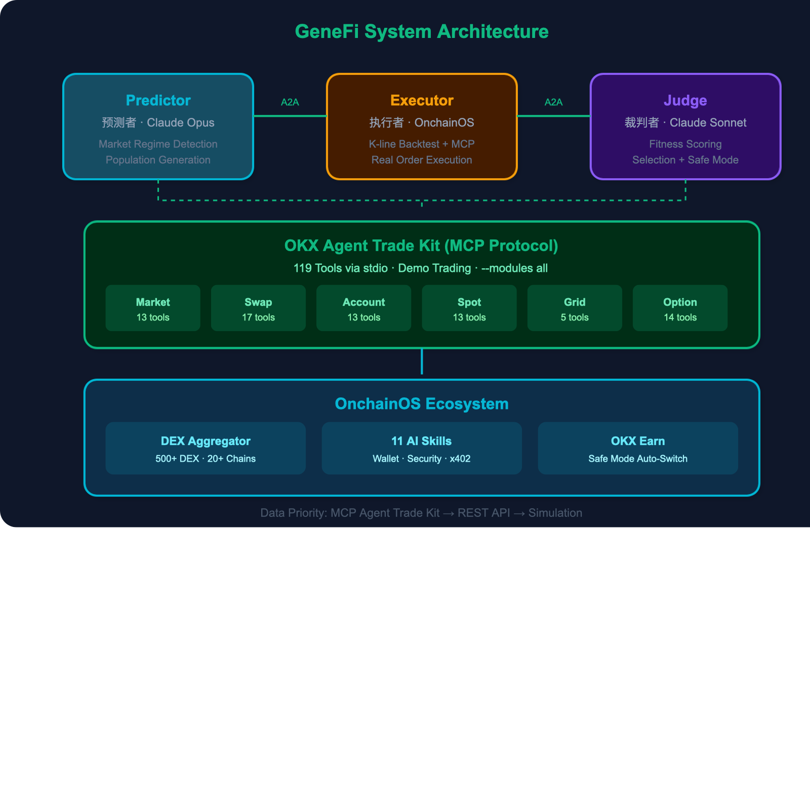

# GeneFi - 基因金融 | Gene + DeFi Evolution Engine

<div align="center">

**用遗传进化算法驱动 DeFi 交易策略自适应优化的多智能体系统**

*A multi-agent system powered by genetic evolution for adaptive DeFi trading strategy optimization*

[](https://www.okx.com/zh-hans/agent-tradekit)
[](https://github.com/okx/agent-trade-kit)
[](https://web3.okx.com/zh-hans/onchainos)
[](https://github.com/okx/onchainos-skills)
[](https://brian5216.github.io/GeneFi/)

**[Live Demo](https://brian5216.github.io/GeneFi/) · [GitHub Repo](https://github.com/Brian5216/GeneFi) · [OKX Agent Trade Kit](https://www.okx.com/zh-hans/agent-tradekit)**

</div>

---

<div align="center">

<br>
<em>System Architecture: 3 AI Agents + 119 MCP Tools + OnchainOS Ecosystem</em>
</div>

---

## What is GeneFi?

GeneFi 将每套交易策略视为**生物个体**，通过遗传变异、交叉互换和自然选择，让策略种群在真实市场中自动进化。

| Biology | GeneFi |
|---|---|
| DNA | Strategy Parameters (leverage, direction, hedge...) |
| Individual | A Complete Trading Strategy |
| Population | All Current Strategies |
| Fitness | Profitability Score |
| Natural Selection | Eliminate Underperformers |
| Mutation | Parameter Tweaks for Offspring |
| Crossover | Gene Combination from Elite Parents |

---

## System Architecture

```
┌─────────────────────────────────────────────────────────────────┐
│                    GeneFi Evolution Engine                       │
│                                                                 │
│   ┌─────────────┐   A2A    ┌─────────────┐   A2A    ┌─────────────┐
│   │  Predictor   │────────>│  Executor    │────────>│    Judge     │
│   │  预测者       │<────────│  执行者       │<────────│    裁判者     │
│   │  Claude Opus │         │  OnchainOS   │         │ Claude Sonnet│
│   └──────┬──────┘         └──────┬──────┘         └──────┬──────┘
│          │                       │                        │
│          │    ┌──────────────────┼────────────────────────┘
│          ▼    ▼                  ▼
│   ┌─────────────────────────────────────────────┐
│   │         OKX Agent Trade Kit (MCP)            │
│   │                                              │
│   │  ┌──────────┐ ┌──────────┐ ┌──────────┐    │
│   │  │ Market    │ │ Swap     │ │ Account  │    │
│   │  │ 13 tools  │ │ 17 tools │ │ 13 tools │    │
│   │  └──────────┘ └──────────┘ └──────────┘    │
│   │  ┌──────────┐ ┌──────────┐ ┌──────────┐    │
│   │  │ Spot     │ │ Option   │ │ Grid     │    │
│   │  │ 13 tools │ │ 14 tools │ │ 5 tools  │    │
│   │  └──────────┘ └──────────┘ └──────────┘    │
│   │                                              │
│   │  Total: 119 MCP Tools via stdio protocol     │
│   └─────────────────────────────────────────────┘
│                         │
│                         ▼
│   ┌─────────────────────────────────────────────┐
│   │           OnchainOS Ecosystem                │
│   │                                              │
│   │  DEX Aggregator    │ 500+ DEX, 20+ Chains   │
│   │  AI Skills (11)    │ Wallet, Security, x402  │
│   │  Earn API          │ Safe Mode Auto-Switch   │
│   └─────────────────────────────────────────────┘
└─────────────────────────────────────────────────────────────────┘
```

---

## Evolution Flow

```
 ┌─────────┐    ┌─────────┐    ┌─────────┐    ┌─────────┐    ┌─────────┐
 │ 1. 检测  │───>│ 2. 生成  │───>│ 3. 回测  │───>│ 4. 评分  │───>│ 5. 进化  │
 │ Detect   │    │ Generate │    │ Backtest │    │ Score    │    │ Evolve   │
 │ Regime   │    │ Pop      │    │ Candles  │    │ Fitness  │    │ Select   │
 └─────────┘    └─────────┘    └─────────┘    └─────────┘    └────┬────┘
      ▲                                                            │
      └────────────────────── Next Generation ─────────────────────┘

Fitness = 0.5 × PnL% + 0.3 × FundingYield × 50 − 0.2 × MaxDrawdown

Population: Elite (Top 20%) → Survive (Mid 50%) → Eliminate (Bottom 30%)
```

---

## OKX Integration Map

```
┌──────────────────────────────────────────────────────────────┐
│                   GeneFi × OKX Integration                    │
├──────────────────────────────────────────────────────────────┤
│                                                              │
│  ┌─ Agent Trade Kit (MCP Protocol) ────────────────────────┐ │
│  │  119 tools via stdio • Demo Trading mode                 │ │
│  │                                                          │ │
│  │  market_get_ticker       → Live BTC/ETH price            │ │
│  │  market_get_funding_rate → Funding rate detection         │ │
│  │  swap_place_order        → Futures order execution        │ │
│  │  swap_close_position     → Position management            │ │
│  │  swap_set_leverage       → Risk control (1-20x)           │ │
│  │  account_get_balance     → Portfolio tracking              │ │
│  │  grid_create_order       → Grid bot deployment            │ │
│  │  spot_place_order        → Spot trading                   │ │
│  └──────────────────────────────────────────────────────────┘ │
│                                                              │
│  ┌─ OnchainOS DEX Aggregator ──────────────────────────────┐ │
│  │  500+ DEX • 20+ chains • Smart order splitting           │ │
│  │  ETH / ARB / OP / MATIC / BASE / BSC / X Layer           │ │
│  └──────────────────────────────────────────────────────────┘ │
│                                                              │
│  ┌─ 11 AI Skills Installed ────────────────────────────────┐ │
│  │  agentic-wallet │ dex-swap   │ security    │ x402       │ │
│  │  dex-market     │ dex-token  │ audit-log   │ gateway    │ │
│  │  dex-signal     │ trenches   │ portfolio                │ │
│  └──────────────────────────────────────────────────────────┘ │
│                                                              │
│  ┌─ OKX Earn (Safe Mode) ──────────────────────────────────┐ │
│  │  Auto-switch when fitness declines 3+ consecutive gens   │ │
│  └──────────────────────────────────────────────────────────┘ │
│                                                              │
│  Data Priority: MCP Agent Trade Kit → REST API → Simulation  │
└──────────────────────────────────────────────────────────────┘
```

---

## Strategy Gene Model

```
┌─────────────────────────────────────────────────────────┐
│                  9-Gene Strategy Chromosome               │
├────────────────┬──────────┬─────────────────────────────┤
│ Gene           │ Range    │ Description                  │
├────────────────┼──────────┼─────────────────────────────┤
│ leverage       │ 1-20x    │ Position leverage            │
│ entry_threshold│ 0.1-0.95 │ Entry signal sensitivity     │
│ exit_threshold │ 0.05-0.6 │ Exit trigger level           │
│ hedge_ratio    │ 0-1.0    │ Hedging proportion           │
│ stop_loss_pct  │ 2-15%    │ Stop loss percentage         │
│ take_profit_pct│ 5-30%    │ Take profit percentage       │
│ direction      │ L/S/N    │ Long, Short, or Neutral      │
│ chain          │ 6 chains │ ETH, ARB, OP, MATIC, BASE...│
│ strategy_type  │ 4 types  │ Arb, Grid, Momentum, MR     │
└────────────────┴──────────┴─────────────────────────────┘
```

---

## Quick Start

```bash
# Clone
git clone https://github.com/Brian5216/GeneFi.git && cd GeneFi

# Install dependencies
pip install -r requirements.txt && npm install

# (Optional) OKX Demo Trading
cp .env.example .env  # Edit with your OKX API keys

# Start
python3 -m uvicorn main:app --host 0.0.0.0 --port 8001 \
  --loop asyncio --http h11 --ws websockets &
node serve.js

# Open http://localhost:8000
```

### Docker

```bash
docker-compose up --build
# Open http://localhost:8000
```

### MCP Setup

```bash
npm install -g okx-trade-mcp
npx skills add okx/onchainos-skills --yes
```

---

## Tech Stack

| Layer | Technology |
|---|---|
| Backend | Python 3.11 + FastAPI + Uvicorn |
| Frontend | Vanilla JS + SVG + Canvas (zero dependencies) |
| Communication | WebSocket + A2A JSON Protocol |
| Trading (MCP) | OKX Agent Trade Kit (119 tools via MCP stdio) |
| DeFi | OnchainOS DEX Aggregator (500+ DEX) |
| AI Models | Claude Opus (Predictor) + Claude Sonnet (Judge) |
| Deployment | Docker multi-stage + Node.js reverse proxy |

---

## API Endpoints

| Endpoint | Description |
|---|---|
| `GET /` | Dashboard (4-tab UI) |
| `WS /ws` | Real-time WebSocket |
| `GET /api/status` | System + MCP stats |
| `GET /api/market` | Live market (MCP source) |
| `GET /api/account` | Balance & positions |
| `GET /api/export` | Export top strategies |
| `GET /api/backtest` | Evolved vs random |
| `GET /api/dex_quote` | DEX swap quote |
| `GET /api/simulate_investment` | Investment simulator |
| `GET /api/monte_carlo` | Statistical validation |

---

## Project Structure

```
GeneFi/
├── main.py                     # FastAPI + WebSocket + evolution loop
├── config.py                   # Configuration
├── serve.js                    # Node.js reverse proxy
├── mcp_proxy.js                # MCP proxy (undici ProxyAgent)
├── dtes/
│   ├── core/
│   │   ├── strategy.py         # 9-gene chromosome model
│   │   ├── fitness.py          # Normalized fitness function
│   │   ├── evolution.py        # Evolution engine
│   │   └── backtest.py         # Monte Carlo backtester
│   ├── agents/
│   │   ├── predictor.py        # Market regime → population
│   │   ├── executor.py         # Strategy execution + OKX trading
│   │   └── judge.py            # Fitness evaluation + safe mode
│   ├── protocol/
│   │   └── a2a.py              # A2A protocol + audit log
│   └── okx/
│       ├── onchain_os.py       # OKX integration (MCP priority)
│       ├── mcp_bridge.py       # Python ↔ MCP stdio bridge
│       └── dex_aggregator.py   # 500+ DEX aggregation
├── .agents/skills/             # 11 OnchainOS AI Skills
├── static/                     # Dashboard UI
├── Dockerfile                  # Multi-stage build
└── docker-compose.yml          # Container orchestration
```

---

<div align="center">

Built for **OKX AI Hackathon Season 2** | Powered by Claude + OKX Agent Trade Kit

[Live Demo](https://brian5216.github.io/GeneFi/) · [GitHub](https://github.com/Brian5216/GeneFi)

</div>
